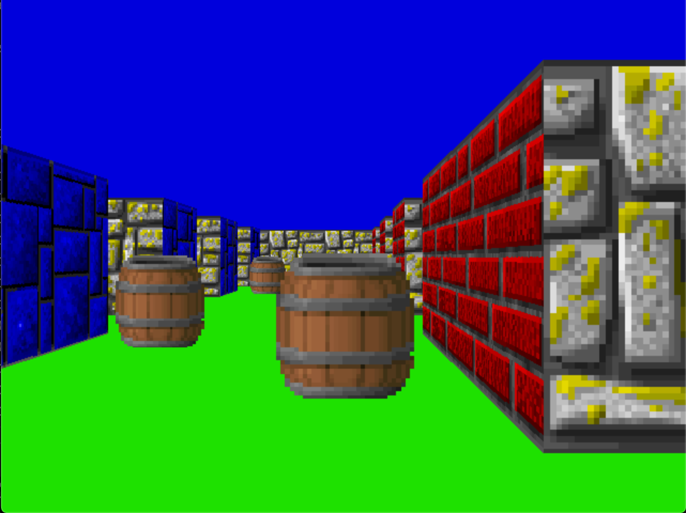

# Cub3d
- 울펜슈타인에서 사용한 raycasting 기법을 이용하여 Semi-3D 구현

## 기능
- WASD 키를 사용하여 플레이어 움직임
- 왼쪽 / 오른쪽 방향키를 이용하여 카메라 움직임

## 사용된 기술 및 알고리즘
- dfs
- raycastring

## 고려사항
1. 맵 탐색 강화
- 플레이어를 기준으로 탐색 vs 맵의 모든 빈칸을 기준으로 탐색
